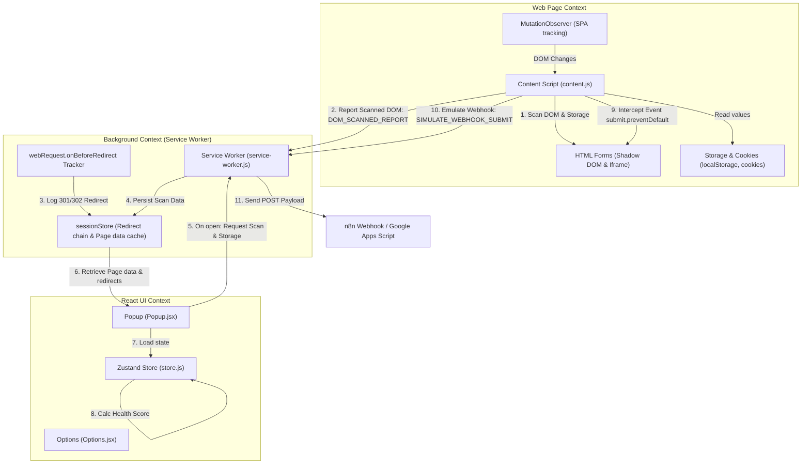
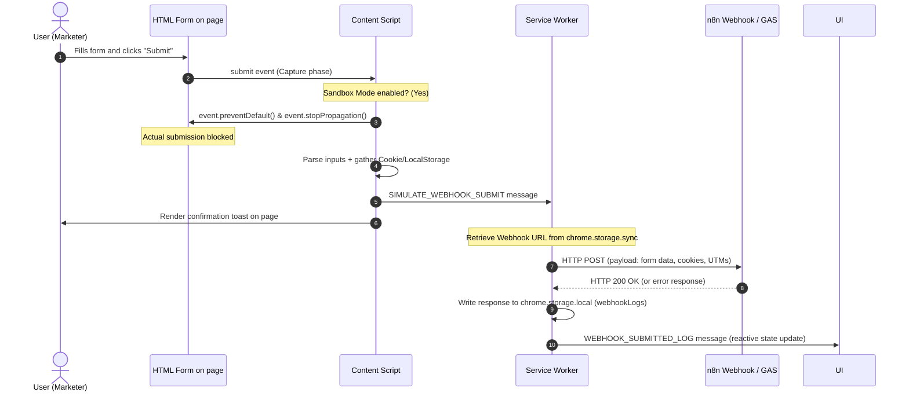

# Developer Guide: Dynamic UTM & Lead Source Validator

This document describes the internal architecture, workflow logic, data streams, and implementation details of the **Dynamic UTM & Lead Source Validator** Chrome extension. This guide is intended for developers who will extend, test, or implement this extension.

---

## 🏗 Architecture and Component Interaction

The application is designed modularly based on **Manifest V3**. It consists of three isolated execution environments:
1. **Content Script** (Context of the web page).
2. **Background Script / Service Worker** (Background context of the extension).
3. **Popup & Options Pages** (React-based user interface context).

The general architecture and message passing scheme is illustrated below:



---

## 📁 Directory Structure and File Guide

```text
/UTM-Validator
  ├── manifest.json                  # Manifest V3 configuration (permissions, script paths)
  ├── vite.config.js                  # Vite config with html2canvas-pro alias and multi-entry points
  ├── package.json                   # Project dependencies (React 19, Zustand, html2pdf.js, Tailwind v4)
  ├── test_health_score.js           # Unit tests for the Health Score algorithm
  ├── src/
  │   ├── index.css                  # Tailwind v4 styles + custom Glassmorphic design
  │   ├── background/
  │   │   └── service-worker.js      # Background script: redirect hooks, frame aggregation, CORS proxy
  │   ├── content/
  │   │   └── content.js             # Content script: Shadow DOM traversal, MutationObserver, Sandbox intercept
  │   ├── popup/
  │   │   ├── index.html             # HTML entry point for Popup
  │   │   ├── main.jsx               # React entry point for Popup
  │   │   ├── store.js               # Zustand store containing Health Score calculations
  │   │   └── Popup.jsx              # UI Dashboard, Data Tree, Sandbox, and PDF/MD export layouts
  │   └── options/
  │       ├── index.html             # HTML entry point for Options Page
  │       ├── main.jsx               # React entry point for Options Page
  │       └── Options.jsx            # Settings page for custom parameters and webhook logs
```

---

## 🔄 In-Depth Workflows

### 1. DOM and Shadow DOM Scanning (Content Script)
The scanning process starts automatically when the DOM is loaded (`DOMContentLoaded`), upon dynamic DOM modifications via `MutationObserver` (debounced at 300ms to prevent interface lags), and by manual request from the Popup (`TRIGGER_MANUAL_SCAN`).

* **Shadow DOM Traversal:** Standard `document.querySelectorAll` does not inspect elements inside the Shadow DOM. The recursive `scanShadowDOM` function checks the `shadowRoot` property of all page elements, pulling out forms and inputs.
* **Iframe Support (`all_frames: true`):** The content script is injected into every frame on the page. The top-level frame reads page cookies and local storage, while subframes inspect their local DOM and report findings to the Service Worker. The Service Worker aggregates subframe forms, marking them as `isIframe: true`.

---

### 2. Redirect Tracking (Background Script)
Lead attribution frequently fails due to server-side redirects (e.g., HTTP to HTTPS or trailing slash normalization) stripping query parameters.

* **Capture:** The service worker hooks into `chrome.webRequest.onBeforeRedirect`, storing redirect hops in the session cache (`redirects_{tabId}`).
* **Cache Expiry:** To avoid memory leaks as users browse between different sites, the script listens to `chrome.webNavigation.onCommitted`. If navigation is direct (not a redirect), the redirect chain cache is cleared for that tab.

---

### 3. Sandbox Mode 2.0 (Form Submission Interception)
Designed for stress-testing form submits to n8n/GAS without polluting the client's production CRM with mock leads.



---

### 4. Health Score & Penalty Algorithm (Zustand Store)
The page health metric is calculated dynamically using this formula:

$$S = \max \left(0, 100 - \sum_{i=1}^{n} (w_i \cdot c_i) \right)$$

Penalty weights ($w_i$) are defined in [store.js](src/popup/store.js):
* **🔴 Critical (-40):** UTMs exist in URL but are missing from DOM forms and storage.
* **🔴 Critical (-40):** Redirect chain stripped UTM parameters before the page loaded.
* **🟠 High (-30):** Hidden fields are present, but Sandbox Mode transmits them empty.
* **🟠 High (-15):** GDPR/CCPA Prior Consent Violation (marketing/tracking cookies set before consent).
* **🟡 Medium (-15):** No UTMs in URL, and forms lack hidden inputs/slots to capture them.
* **🔵 Blue (-10):** Core web analytics cookies (`_ga`, `_ym_uid`) are missing, though script blocks exist.

---

### 5. PDF Generation Details (Off-Screen Canvas)
PDF exports are compiled via `html2pdf.js` with `html2canvas-pro` (a customized fork) to prevent crashes when processing modern Tailwind CSS v4 HSL/OKLCH color space notations.

To avoid layout shift issues in the popup, the report canvas is rendered at absolute coordinates off-screen:
```html
<div style={{ position: 'absolute', left: '-9999px', top: '0px', width: '210mm', overflow: 'hidden' }}>
  <div ref={reportRef} className="bg-slate-950 p-8 ...">
    <!-- A4 PDF Template -->
  </div>
</div>
```
This lets the browser resolve element geometry for PDF pages while keeping the template completely hidden from popup users.

---

### 6. GDPR/CCPA Prior Consent Audit
To protect client domains from high regulatory fines under GDPR and CCPA, the extension implements a prior-consent audit checks loop:
* **Consent Signature Detection:** The extension monitors active cookies for signatures from leading Consent Management Platforms (CMPs). The matching list in `store.js` targets:
  - **OneTrust / Optanon:** `optanonconsent`, `optanonalertboxclosed`
  - **Cookiebot:** `cookieconsent`
  - **CookieYes:** `cookieyes-consent`
  - **Other CMPs / Standards:** `cookieconsent_status`, `euconsent-v2`, `gdpr_consent`, `ccpa-consent`
* **Attribution & Tracker Cookie Registry:** The engine checks for tracking cookies set by analytic tools or advertising pixels (e.g., `_ga`, `_ym_uid`, `_fbp`, `hubspotutk`, `_mkto_trk`).
* **Compliance Assertions:**
  - **Compliant:** No tracking cookies are set, OR a tracking cookie is set and a valid CMP consent cookie is also present on the domain.
  - **Non-Compliant (Prior Consent Violation):** Active tracking cookies are found in storage, but no CMP consent cookies are present. This triggers a `-15 points` deduction and records a High-level warning outlining the specific cookies set prematurely.

---

### 7. AI Patch Assistant Engine
To assist developers in addressing missing attribution inputs, the extension integrates an AI generation workspace inside `DataTreeTab.jsx`:
* **Prompt Assembly:** The system extracts the parsed form properties (`id`, `className`, `action`, `isShadow`) and inputs structure. It calculates only the missing keys specifically for this form to keep the context minimal, and builds a comprehensive instruction prompt.
* **Execution Paths:**
  1. **Google Gemini API:** If `geminiApiKey` is saved in options, the extension fires an HTTP POST request to Google's official endpoints using the `gemini-2.5-flash` model.
  2. **Chrome built-in window.ai:** Fallback checking for local browser model APIs (`window.ai.languageModel` or `window.ai.assistant`).
  3. **Manual Export:** A Copy button copies the generated prompt directly for pasting into web LLM interfaces.
* **Payload Integrity & UI Transitions:**
  - Code outputs are parsed from markdown and extracted from code blocks (\````javascript ... ````) automatically.
  - Interactive loader animations (Skeleton elements) and visual confirmation states guide the user.

---

## 🛠 Compilation and Debugging

1. Install dependencies:
   ```bash
   npm install
   ```
2. Run health score logic unit tests:
   ```bash
   npm run test
   ```
3. Compile the production extension bundle:
   ```bash
   npm run build
   ```
   Compiled assets will be placed in the `dist/` directory. Load this directory as an unpacked extension in Chrome.
