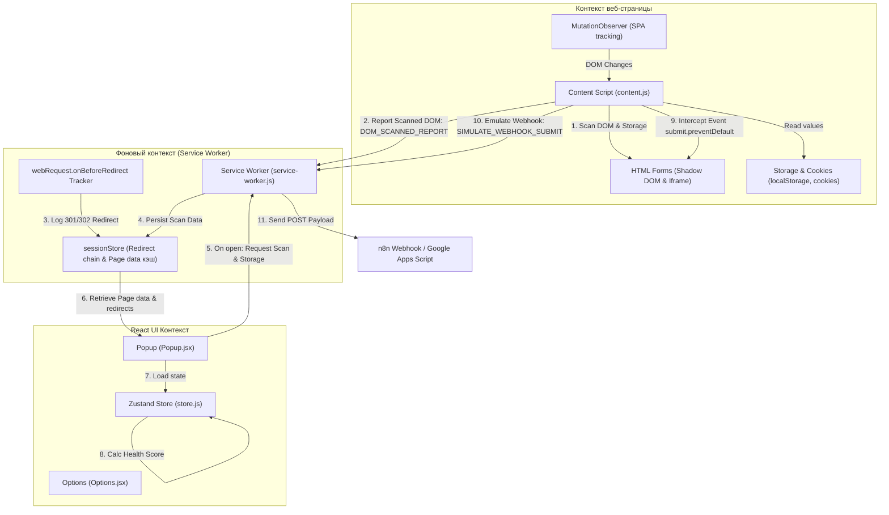
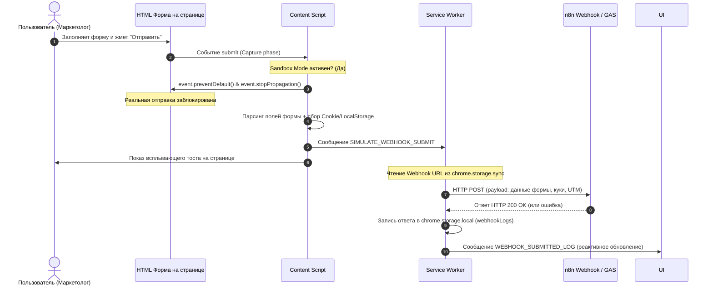

# Руководство разработчика: Dynamic UTM & Lead Source Validator

Этот документ описывает внутреннюю архитектуру, логику работы, потоки данных и особенности реализации расширения Chrome **Dynamic UTM & Lead Source Validator**. Руководство предназначено для разработчиков, которые будут развивать, тестировать или внедрять данное расширение.

---

## 🏗 Архитектура и взаимодействие компонентов

Приложение спроектировано по модульному принципу на базе **Manifest V3**. Оно состоит из трех изолированных сред выполнения:
1. **Content Script** (Контекст веб-страницы).
2. **Background Script / Service Worker** (Фоновый контекст расширения).
3. **Popup & Options Pages** (Контекст интерфейса на React).

Общая схема взаимодействия и обмена сообщениями представлена ниже:



---

## 📁 Структура каталогов и назначение файлов

```text
/UTM-Validator
  ├── manifest.json                  # Конфигурация Manifest V3 (права доступа, пути скриптов)
  ├── vite.config.js                  # Конфигурация Vite с алиасом html2canvas-pro и мульти-входами
  ├── package.json                   # Зависимости проекта (React 19, Zustand, html2pdf.js, Tailwind v4)
  ├── test_health_score.js           # Автономные Unit-тесты алгоритма Health Score
  ├── src/
  │   ├── index.css                  # Глобальные стили Tailwind v4 + кастомный Glassmorphic дизайн
  │   ├── background/
  │   │   └── service-worker.js      # Фоновый процесс: перехват редиректов, агрегация фреймов, CORS-прокси
  │   ├── content/
  │   │   └── content.js             # Контент-скрипт: обход Shadow DOM, MutationObserver, Sandbox-перехват
  │   ├── popup/
  │   │   ├── index.html             # Точка входа HTML для Popup
  │   │   ├── main.jsx               # Точка входа React для Popup
  │   │   ├── store.js               # Zustand-стор расширения с математикой Health Score
  │   │   └── Popup.jsx              # Реализация дашборда, Data Tree, Sandbox и PDF/MD экспорта
  │   └── options/
  │       ├── index.html             # Точка входа HTML для Options Page
  │       ├── main.jsx               # Точка входа React для Options Page
  │       └── Options.jsx            # Страница настроек кастомных ключей и логов вебхуков
```

---

## 🔄 Детальное описание ключевых процессов

### 1. Сканирование DOM и Shadow DOM (Content Script)
Процесс сканирования запускается автоматически при загрузке DOM (`DOMContentLoaded`), при динамических изменениях страницы через `MutationObserver` (с дебаунсом 300мс во избежание фризов интерфейса) и по ручному запросу из Popup (`TRIGGER_MANUAL_SCAN`).

* **Обход Shadow DOM:** Обычный `document.querySelectorAll` не проникает внутрь Shadow DOM. Метод `scanShadowDOM` рекурсивно проверяет каждое свойство `shadowRoot` у всех элементов на странице, извлекая формы и инпуты.
* **Поддержка Iframe (`all_frames: true`):** Контентный скрипт внедряется во все фреймы на странице. Главный фрейм собирает куки и локальное хранилище страницы, а подфреймы сканируют свой локальный DOM и отправляют отчеты в Service Worker. Service Worker склеивает формы подфреймов, помечая их флагом `isIframe: true`.

---

### 2. Отслеживание редиректов (Background Script)
Сквозная аналитика часто ломается из-за некорректных серверных редиректов (например, переход с `http` на `https` или сброс слэша в конце URL), стирающих параметры запроса.

* **Захват:** Скрипт слушает события `chrome.webRequest.onBeforeRedirect`, извлекая цепочку редиректов и записывая их в сессионный кэш `redirects_{tabId}`.
* **Очистка кэша:** Для предотвращения накопления мусора при переходах пользователя на новые сайты, скрипт слушает событие `chrome.webNavigation.onCommitted`. Если переход совершен напрямую (не является редиректом), цепочка редиректов для данной вкладки очищается.

---

### 3. Режим Sandbox Mode 2.0 (Перехват отправки лидов)
Предназначен для стресс-тестирования отправки форм на n8n/GAS без риска отправки дублирующих лидов в основную CRM клиента.



---

### 4. Алгоритм Health Score и Штрафных баллов (Zustand Store)
Здоровье страницы рассчитывается динамически на основе формулы:

$$S = \max \left(0, 100 - \sum_{i=1}^{n} (w_i \cdot c_i) \right)$$

Веса штрафов ($w_i$) зафиксированы в [store.js](file:///Users/nata/Desktop/Леонид%20Временная/UTM%20Validator/src/popup/store.js):
* **🔴 Critical (-40):** Метки есть в URL, но отсутствуют в DOM-формах и в Storage.
* **🔴 Critical (-40):** Редирект стёр UTM-параметры до момента открытия целевой страницы.
* **🟠 High (-30):** Метки в формах есть, но при отправке Sandbox Mode передает их пустыми.
* **🟡 Medium (-15):** В URL меток нет, но и формы не подготовлены к их приёму (нет скрытых полей).
* **🔵 Blue (-10):** Отсутствуют основные куки веб-аналитики (`_ga`, `_ym_uid`), хотя скрипты подключены.

---

### 5. Логика PDF-генерации (Off-Screen Canvas)
Экспорт PDF-отчетов реализован через `html2pdf.js` с использованием библиотеки `html2canvas-pro` (вместо стандартной), чтобы исключить краш при разборе цветов `oklch()`, применяемых в Tailwind CSS v4.

Для исключения влияния на основной Popup, элемент шаблона отчета отрендерен на абсолютных координатах вне экрана:
```html
<div style={{ position: 'absolute', left: '-9999px', top: '0px', width: '210mm', overflow: 'hidden' }}>
  <div ref={reportRef} className="bg-slate-950 p-8 ...">
    <!-- Шаблон А4 отчета -->
  </div>
</div>
```
Это позволяет браузеру рассчитать геометрию элементов для PDF, но скрывает его от пользователя интерфейса расширения.

---

## 🛠 Порядок сборки и отладки

1. Установите зависимости:
   ```bash
   npm install
   ```
2. Запустите тесты бизнес-логики Health Score:
   ```bash
   npm run test
   ```
3. Соберите проект:
   ```bash
   npm run build
   ```
   Скомпилированные файлы появятся в папке `dist/` в корне проекта. Загрузите её как unpacked-расширение в Chrome.
